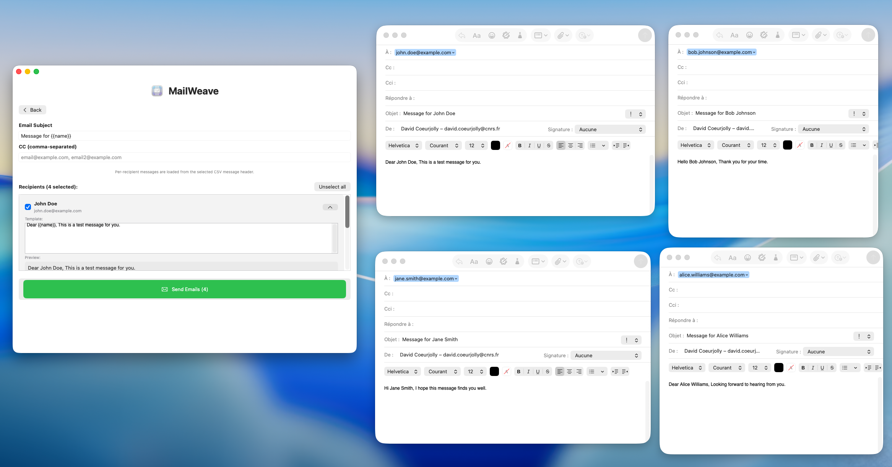

# MailWeave


Current version: `0.1`


[](https://github.com/dcoeurjo/MailWeave/actions/workflows/objective-c-xcode.yml)

MailWeave(beta) is a simple macOS app that lets you create personalized email drafts in Mail.app using a CSV file. For example, your CSV might look like this:
```csv
name,email,company,message
Jane Doe,jane.doe@example.com,Acme,Hello {{name}} from {{company}} Greetings!
John Doe,john.doe@example.com,Acme,Hello {{name}} from {{company}} !
```

MailWeave generates draft emails with the placeholders replaced by the corresponding values, so you can review them before sending.




## Features

- **CSV Import**: Import recipient data from CSV files. Delimiter selection is available next to the import button (default: `;`). CSV cells may include multiline text
- **Header Mapping + Message Mode**: Choose whether messages are global or per-recipient. `email` mapping is always required; `message` mapping is required only in per-recipient mode
- **Message Personalization**: Use `{{header}}` placeholders (e.g., `{{name}}`, `{{blop}}`)
- **Global message**: You can use the same message template for all recipients
- **Header Helper in Compose**: While editing the default message, MailWeave shows available `{{header}}` placeholders
- **Per-Recipient Preview**: In compose step, each recipient preview shows the message with placeholders already replaced
- **Subject + CC**: Global subject and CC list with placeholder support
- **Two-Step Flow**: Import + mapping first, compose and review recipients second
- **Mail.app Integration**: Creates draft emails in Mail.app for review before sending

## Requirements

- macOS 13.0 or later
- Xcode 15.0 or later
- Swift 5.0 
- Mail.app configured with an email account

## Installation

1. Open the project in Xcode.
2. Build and run the project (⌘R).

## Usage

1. **Prepare your CSV file** with a header row.
2. **Import the CSV** in MailWeave. Delimiter is selected from the compact control next to the import button (default is `;`).
3. **Choose message mode** in the first step:
   - `Global message`: map `email` only.
   - `Per recipient`: map both `email` and `message`.
4. Click **Proceed**.
5. **Customize** the subject, CC list, and message template. Use placeholders like `{{name}}` or any header.
6. **Review recipients** and select who to send.
7. **Send emails** to create Mail.app drafts.

## CSV Format

- The first row must be a header row.
- No specific header names are required.
- Before proceeding, select a header for `email`.
- Default CSV delimiter is `;` (semicolon).
- If message mode is `Per recipient`, selecting a `message` header is required.
- If message mode is `Global message`, `message` header mapping is not needed.
- If a `name` column exists, it is used for recipient display/personalization; otherwise MailWeave derives a fallback name from the email local-part.
- Additional headers are supported and can be referenced in the message template.

See example in `sample_recipients.csv`

## Message Personalization

You can use any header name as a placeholder in the subject, CC, or message body.

When editing the default message template, MailWeave displays the available headers.

Example:

```
Hi {{name}},

Thanks for your work at {{company}}.
```

## Author

David Coeurjolly (david.coeurjolly@cnrs.fr)

## License

This project is licensed under the GNU General Public License v3.0 (GPL-3.0).

See [LICENSE.md](LICENSE.md) for more information.
